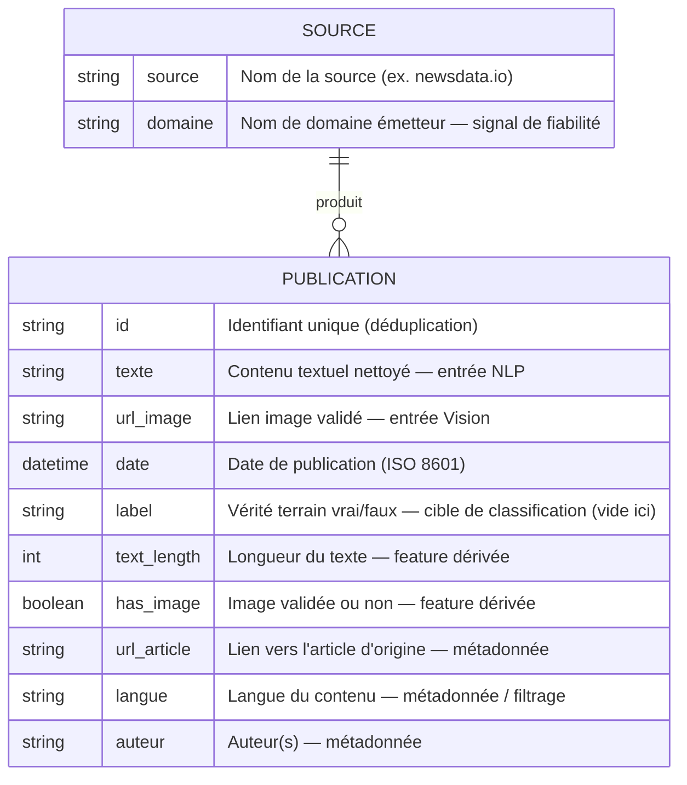

# Schéma de données — Pipeline multimodal CheckItAI

**Étape 3 — modèle conceptuel des données transformées**

Ce document décrit le modèle **conceptuel** des données produites par le pipeline de transformation. Il se place au niveau métier (entités, attributs, relations, rôle dans le cas d'usage IA) et **non** au niveau technique (pas de tables SQL, d'index ni de clés physiques).

## Diagramme conceptuel

## Description des champs

Chaque champ est rattaché à un **rôle** dans le cas d'usage de détection de fake news : entrée du modèle (NLP / Vision), cible d'apprentissage, feature dérivée, ou métadonnée.

| Champ | Type | Rôle dans le cas d'usage IA |
|-------|------|------------------------------|
| `id` | string | Identifiant unique, sert à la déduplication |
| `texte` | string | **Entrée NLP** : texte nettoyé analysé par le modèle de langage |
| `url_image` | string | **Entrée Vision** : lien vers l'image associée, validé par le pipeline |
| `date` | datetime (ISO 8601) | Métadonnée temporelle (fraîcheur, tri, traçabilité) |
| `label` | string \| null | **Cible de classification** vrai/faux — vide pour NewsData.io (pas de vérité terrain) |
| `text_length` | int | Feature dérivée : longueur du texte (filtrage des contenus trop courts) |
| `has_image` | boolean | Feature dérivée / contrôle qualité : confirme la présence d'une image valide |
| `url_article` | string | Métadonnée : lien vers la publication d'origine |
| `langue` | string | Métadonnée : langue, utile au filtrage et au choix du modèle |
| `auteur` | string | Métadonnée : auteur ou compte émetteur |

### Entité `SOURCE`

| Champ | Type | Rôle |
|-------|------|------|
| `source` | string | Nom de la source de données (ex. `newsdata.io`) |
| `domaine` | string | Nom de domaine émetteur — **signal de fiabilité** pour le modèle |

## Lien texte ↔ image

Le point central du projet est garanti par construction : **texte et image vivent dans la même entité `PUBLICATION`**. Une entrée n'est conservée que si `texte` **et** `url_image` sont tous deux valides (champ `has_image = true`). Il n'existe donc aucune publication orpheline (texte sans image ou image sans texte) dans les données finales.

## Relation `SOURCE` → `PUBLICATION`

Une source produit plusieurs publications (relation 1 à plusieurs). Cette séparation conceptuelle distingue ce qui caractérise **l'émetteur** (nom, domaine, fiabilité) de ce qui caractérise **la publication** (texte, image, date). Dans les données plates exportées en JSON, ces informations cohabitent dans chaque entrée ; le modèle conceptuel met en évidence leur nature différente.
